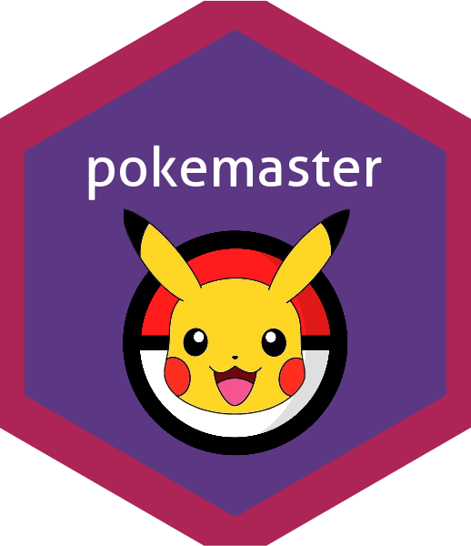

<!-- README.md is generated from README.Rmd. Please edit that file -->

```{r, include = FALSE}
knitr::opts_chunk$set(
  collapse = TRUE,
  comment = "#>",
  fig.path = "man/figures/README-",
  out.width = "100%"
)
```


# pokemaster 

<!-- badges: start -->
<!-- badges: end -->

The goal of pokemaster is to explore the pokemon API. The users can first create a dataframe of the interested pokemons (our default is the 386 pokemons, the first 3 generations). It then helps you generate a pokemon team. You can also see the relevant stats of your team and create a graph of the pokemon team including the selected pokemons.

## Installation

You can install the development version of pokemaster from [GitHub](https://github.com/) with:

``` r
# install.packages("pokemaster")
devtools::install_github("harvard-stat108s23/project2-group3")
```

## About the Data

The [pokemon API](https://pokeapi.co/) contains information on Pokémon, their moves, abilities, types, egg groups and much, much more. An API (Application Programming Interface) is a contract that allow developers to interact with an application through a set of interfaces. In this case, the application is a database of thousands of Pokémon-related objects, and the interfaces are URL links.


## Example 1

This is a basic example which shows you how to retrieve the relevant information we have about a specific Pokemon.

```{r example}
library(pokemaster)
```


```{r cars}
pokedex(c("charizard"))
```
```{r cars}
pokedex(c(6))
```
In the above example, we illustrated how someone could retrieve the relevant information of the pokemon charizard by its name or by its id.

## Example 2

```{r}
pokecard(myteam = c("pikachu","staryu", "exeggutor", "wynaut", "wailmer", "xatu"), color="LightBlue", title="Best Team")
```
```{r}
png(file="pokecard_example.png")
```

You'll still need to render `README.Rmd` regularly, to keep `README.md` up-to-date. `devtools::build_readme()` is handy for this. You could also use GitHub Actions to re-render `README.Rmd` every time you push. An example workflow can be found here: <https://github.com/r-lib/actions/tree/v1/examples>.

You can also embed plots, for example:


In that case, don't forget to commit and push the resulting figure files, so they display on GitHub and CRAN.
